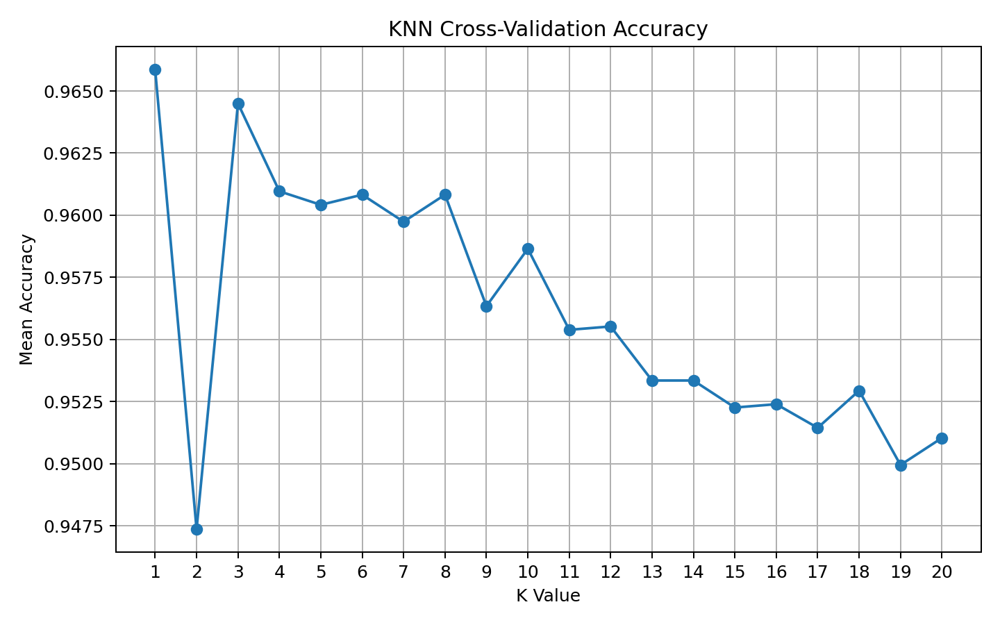
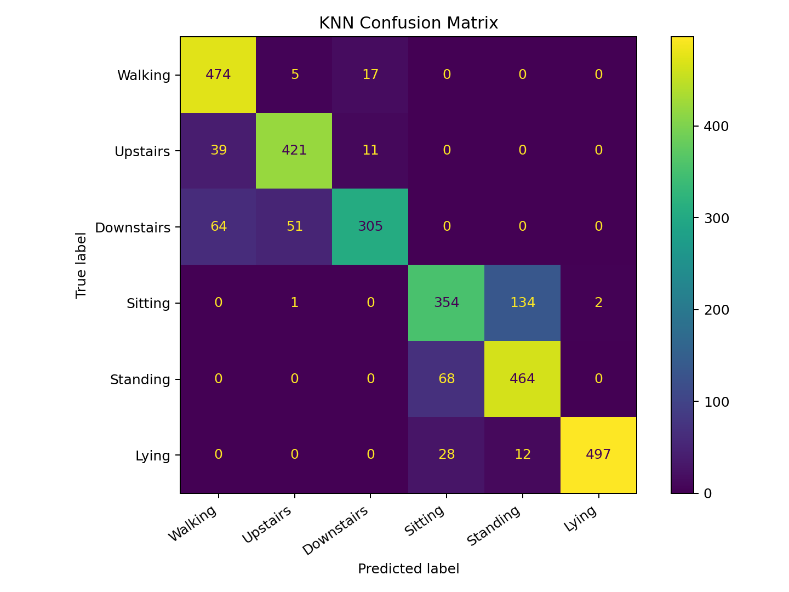

# Human Activity Recognition with KNN

A machine learning project that classifies human activities from smartphone sensor features using a K-Nearest Neighbors (KNN) model.

## Overview

This project was originally completed as part of a Data Analyst internship exercise and later reorganized as a portfolio project.

The dataset contains smartphone accelerometer and gyroscope features collected from 30 volunteers performing six activities:

- Walking
- Walking upstairs
- Walking downstairs
- Sitting
- Standing
- Lying

The goal is to use these sensor features to predict which activity a person is performing.

## Tech Stack

- Python
- NumPy
- scikit-learn
- Matplotlib

## Dataset

The provided dataset contains:

- **7,352 training samples**
- **2,947 test samples**
- **561 features**
- **6 activity classes**

The raw `.npy` files are not included in this repository. See [`data/README.md`](data/README.md) for the expected file structure.

## Methodology

The analysis follows these steps:

1. Load the training and test datasets.
2. Standardize the features using `StandardScaler`.
3. Test KNN models with values of `k` from 1 to 20.
4. Use 5-fold stratified cross-validation on the training data to select the best value of `k`.
5. Train the final model using the selected value of `k`.
6. Evaluate the model on the held-out test set using accuracy, a classification report, and a confusion matrix.

## Results

Cross-validation selected:

- **Best k:** 1
- **Mean 5-fold cross-validation accuracy:** 96.59%
- **Final test accuracy:** 85.34%


The confusion matrix provides a closer look at how the model performs across the six activity classes.



The difference between cross-validation accuracy and final test accuracy shows why it is important to keep the test set separate from model selection.

In the original version of this exercise, different values of `k` were compared directly on the test set. For this portfolio version, I changed the workflow so that `k` is selected using only the training data, while the test set is reserved for final evaluation.

## Repository Structure

```text
human-activity-recognition-knn/
├── data/
│   └── README.md
├── images/
│   ├── knn_confusion_matrix.png
│   └── knn_cv_accuracy.png
├── src/
│   └── train_knn.py
├── .gitignore
├── README.md
└── requirements.txt
```

## How to Run

1. Clone the repository:

```bash
git clone https://github.com/simingdu/human-activity-recognition-knn.git
cd human-activity-recognition-knn
```

2. Install the required packages:

```bash
pip install -r requirements.txt
```

3. Place the four data files in the `data/` folder:

```text
x_train.npy
y_train.npy
x_test.npy
y_test.npy
```

4. Run the model:

```bash
python src/train_knn.py
```

## Limitations

- KNN can become computationally expensive when working with many features.
- The model only compares different values of `k` and does not test alternative distance metrics or weighting methods.
- Participant IDs are not included in the provided files, so model performance cannot be evaluated separately across different participants.
- The difference between cross-validation and test accuracy suggests that results may vary depending on how the data is divided.
